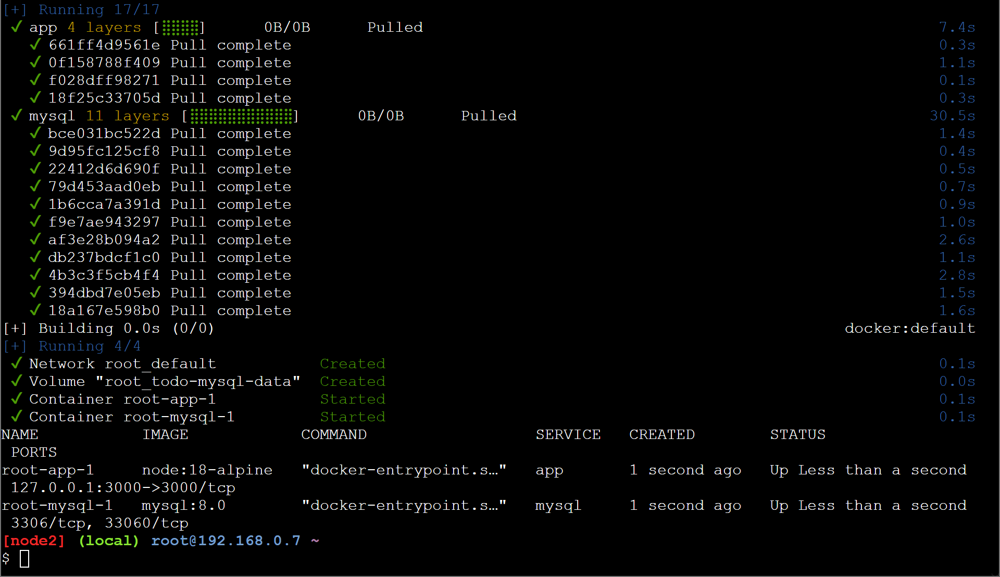

<p align="center">
    <picture>
        <source media="(prefers-color-scheme: dark)" srcset="/img/ifce/logo-vertical-branca_media.png">
        <source media="(prefers-color-scheme: light)" srcset="/img/ifce/logo-vertical-colorida_media.png">
        
    </picture>
</p>

<p align="center"><b>INSTITUTO FEDERAL DE EDUCAÇÃO, CIÊNCIA E TECNOLOGIA DO CEARÁ</b><br>
<b><i>CAMPUS</i> FORTALEZA</b><br>
<b>TECNOLOGIA EM TELEMÁTICA</b></p>

<p align="center">PABLO BUSATTO</p>

<p align="center">17 de novembro de 2023</p>

# Avaliação 8 – Docker Compose
1. Crie uma configuração usando o Docker Compose. Use no mínimo dois serviços. Evidencie o arquivo `docker-compose` e o *print* da execução dos contêineres.

   > Conteúdo do arquivo compose.yml:
   > ```yaml
   > version: "3.8"
   > services:
   >   app:
   >     image: node:18-alpine
   >     command: sh -c "yarn install && yarn run dev"
   >     ports:
   >       - target: 3000
   >         host_ip: 127.0.0.1
   >         published: "3000"
   >         protocol: tcp
   >         mode: host
   >     working_dir: /app
   >     volumes:
   >       - type: bind
   >         source: ./
   >         target: /app
   >     environment:
   >       MYSQ_HOST: mysql
   >       MYSQL_USER: root
   >       MYSQL_PASSWORD: secret
   >       MYSQL_DB: todos
   > 
   >   mysql:
   >     image: mysql:8.0
   >     volumes:
   >       - type: volume
   >         source: todo-mysql-data
   >         target: /var/lib/mysql
   >     environment:
   >       MYSQL_ROOT_PASSWORD: secret
   >       MYSQL_DATABASE: todos
   > volumes:
   >   todo-mysql-data:
   > ```
   > ---
   > Arquivo `.sh` para execução da atividade:
   > ```sh
   > cat > compose.yml << EOL
   > version: "3.8"
   > services:
   >   app:
   >     image: node:18-alpine
   >     command: sh -c "yarn install && yarn run dev"
   >     ports:
   >       - target: 3000
   >         host_ip: 127.0.0.1
   >         published: "3000"
   >         protocol: tcp
   >         mode: host
   >     working_dir: /app
   >     volumes:
   >       - type: bind
   >         source: ./
   >         target: /app
   >     environment:
   >       MYSQ_HOST: mysql
   >       MYSQL_USER: root
   >       MYSQL_PASSWORD: secret
   >       MYSQL_DB: todos
   > 
   >   mysql:
   >     image: mysql:8.0
   >     volumes:
   >       - type: volume
   >         source: todo-mysql-data
   >         target: /var/lib/mysql
   >     environment:
   >       MYSQL_ROOT_PASSWORD: secret
   >       MYSQL_DATABASE: todos
   > volumes:
   >   todo-mysql-data:
   > EOL
   > sudo docker compose up --detach && sudo docker compose ps
   > ```
   > ---
   > 
   > 
   > ***Figura 1**. Execução da atividade no [Play with Docker](https://labs.play-with-docker.com).*
